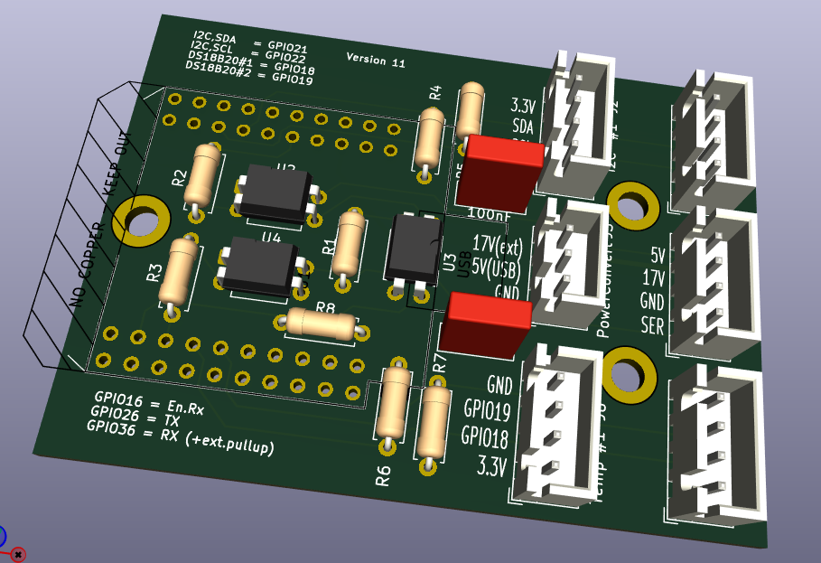
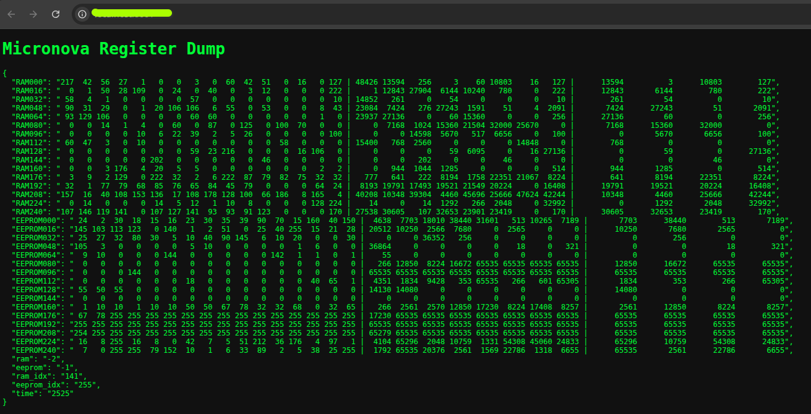
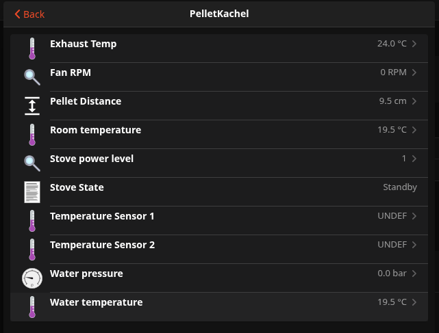

# micronova_stove_esphome
Project for connecting a home automation system to ARTEL IDRO15 PelletStove.
1. Kicad PCB for 'ESP32 mini D1'.
2. Arduino-code for reading all RAM- and EEPROM-registers easily.
3. ESPHOME-yaml for connecting the PelletStove to e.g. Home Assistent or OpenHAB.

## Contained projects:

### 1) Kicad `stove-reader-pcb`
A Kicad project for PCB to fit an 'ESP32 mini D1' to communicate with a PelletStove having a MicroNova compatible serial interface.

The PCB has JST-XH2.54 connectors for
- 2x I2C devices
- 2x external DSB18B20 temperature sensors
- 1x for power conversion
- 1x pelletstove serial

### 2) Arduino `stove-ram-reader`
Works in combination with the PCB.
Code is for ArduinoIDE 2.x to program an 'ESP32 mini D1'.
Program to interrogate the RAM and EEPROM registers and publishes it via its webserver.
Its address is published via mDNS as `esp32.local`
Webserver can be accessed at http://esp32.local/

Uses a version of:
- `micronova_stove.h` code from https://github.com/eni23/micronova-controller
- `micronova_stove.cpp` code from https://github.com/eni23/micronova-controller

### 3) ESPHOME yaml
Works in combination with the PCB.

YAML which interfaces with 
- i2c OLED 128x32, for local readout.
- pellet level sensor (VL53L0X time-of-flight infrared distance sensor).
- external temperature sensors (not connected in below image).

## Related info:
- https://github.com/eni23/micronova-controller
- https://esphome.io/components/micronova/
